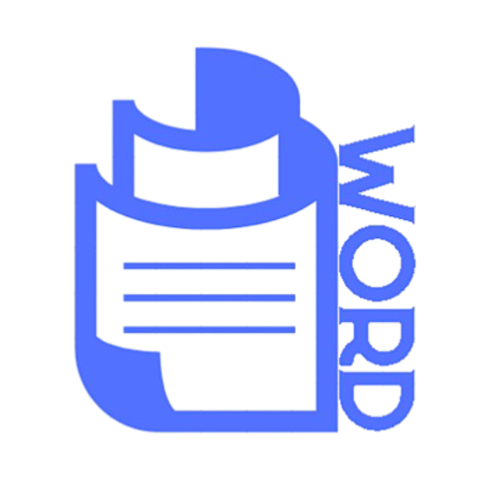

<p align="center">
  
</p>

<p align="center">
  A modern, browser-based word processor with a rich editing experience.
</p>

## Features

- **Rich Text Editing** – Formatting, fonts, colors, highlights, hyperlinks, and more
- **Multi-Page Documents** – Add, navigate, and manage multiple pages
- **Canvas Tools** – Insert images, shapes, text boxes, and arrange objects freely
- **Find & Replace** – Search and replace text throughout your document
- **Export** – Download documents as SVG / images
- **Auto-Save** – Work is persisted in your browser between sessions
- **Modern UI** – Fast, responsive interface with a polished loading screen

## Tech Stack

- [React](https://react.dev/) + [TypeScript](https://www.typescriptlang.org/)
- [Vite](https://vitejs.dev/)
- [Fabric.js](https://fabricjs.com/) – canvas & object editing
- [JSZip](https://stuk.github.io/jszip/)

## Getting Started

```bash
# Install dependencies
npm install

# Start the dev server
npm run dev

# Build for production
npm run build

# Preview the production build
npm run preview
```
<p align="center">
  <strong>Word Doc</strong> · Made by <strong>Meet Duggar </strong>
</p>
